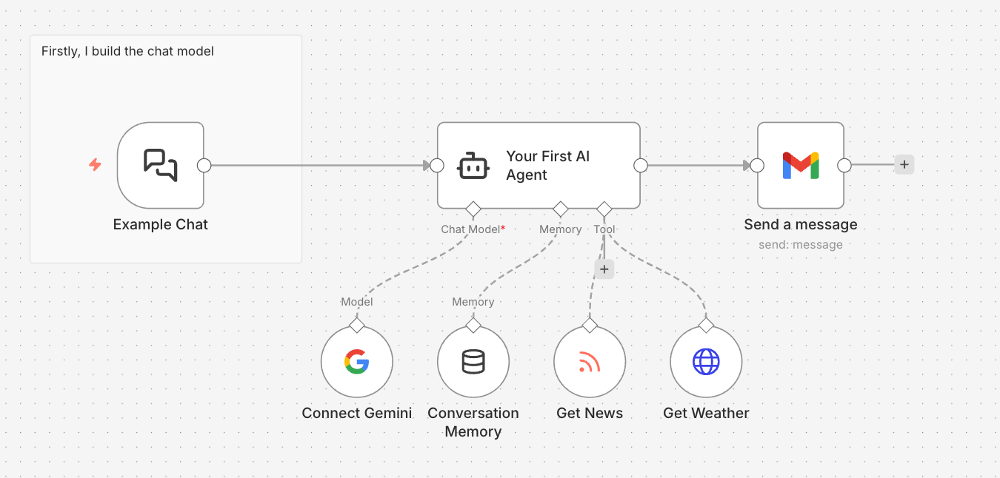

# AI-Weather-Agent
This project demonstrates how an AI agent can process user input, use external tools, retain memory, and automate actions such as sending emails. The workflow integrates a chat interface with an AI model, memory storage, and real-time data tools (news and weather).

## What the project does

This project implements a fully autonomous AI agent workflow built in **n8n**.
When triggered, the agent:

- Accepts a natural language query via chat input
- Retrieves live **weather forecasts** and **top news headlines** via external APIs
- Reasons over the results using **Google Gemini LLM** with persistent conversation memory
- Composes a personalised, context-aware summary and delivers it automatically via **Gmail**

The agent follows the **LLM + Tools + Memory + Actions** architecture — a pattern
used in production-grade AI systems for intelligent automation and decision support.

```
Chat input → Gemini LLM → Weather + News APIs → Reason + Memory → Gmail delivery
```


